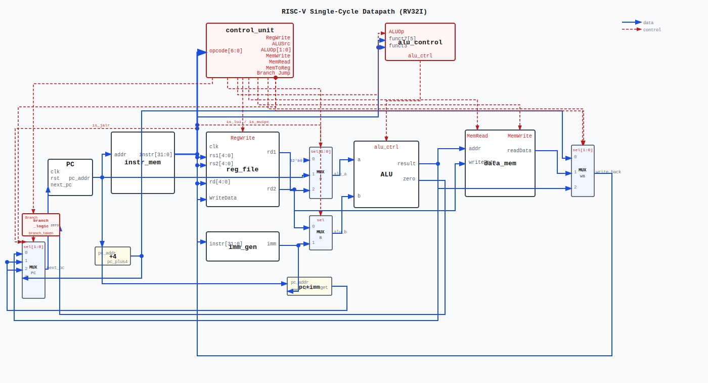

# RISC-V Single-Cycle CPU

A single-cycle RV32I processor implemented in SystemVerilog. Each instruction completes in one clock cycle. Verified with cocotb testbenches using Verilator as the simulator.

---

## Architecture

The datapath follows the classic single-cycle RISC-V design: fetch, decode, execute, memory, and writeback all happen within a single clock cycle.



```
         ┌─────┐    ┌──────────┐    ┌──────────────┐
clk ────►│ PC  │───►│ instr_mem│───►│ control_unit │
rst ────►│     │    └──────────┘    └──────┬───────┘
         └──┬──┘         │                 │ RegWrite, ALUSrc,
            │            │ instr           │ MemWrite, MemRead,
            │            ▼                 │ MemToReg, Branch,
            │     ┌─────────────┐          │ Jump, ALUOp
            │     │   imm_gen   │          │
            │     └──────┬──────┘          │
            │            │ imm             ▼
            │     ┌──────────────┐  ┌─────────────┐
            │     │   reg_file   │  │ alu_control  │
            │     └──┬───────┬───┘  └──────┬──────┘
            │      rd1│     │rd2           │alu_ctrl
            │         │  ALUSrc mux        │
            │         │  ┌──────┐          │
            │         └─►│ ALU  │◄─────────┘
            │            └──┬───┘
            │               │ alu_result
            │        ┌──────────────┐
            │        │   data_mem   │
            │        └──────┬───────┘
            │               │
            │         MemToReg mux
            │               │ write_back
            │        ┌──────────────┐
            └───────►│  reg_file WB │
                     └──────────────┘
```

### PC Next Selection
```
Jump & JALR  →  alu_result       (rs1 + imm)
Jump & JAL   →  pc + imm
Branch taken →  pc + imm
Default      →  pc + 4
```

---

## Modules

| Module | File | Description |
|--------|------|-------------|
| `riscv_core` | `rtl/core/riscv_core.sv` | Top-level datapath wiring |
| `pc` | `rtl/core/pc.sv` | Program counter with synchronous reset |
| `instr_mem` | `rtl/core/instr_mem.sv` | 256-word instruction ROM |
| `control_unit` | `rtl/core/control_unit.sv` | Main control signal decoder |
| `alu_control` | `rtl/core/alu_control.sv` | Two-stage ALU operation decoder |
| `reg_file` | `rtl/core/reg_file.sv` | 32×32 register file, x0 hardwired to 0 |
| `imm_gen` | `rtl/core/imm_gen.sv` | Immediate sign-extension for all formats |
| `alu` | `rtl/core/alu.sv` | 10-operation arithmetic logic unit |
| `data_mem` | `rtl/core/data_mem.sv` | 256-word data RAM (word-aligned) |
| `riscv_pkg` | `rtl/common/riscv_pkg.sv` | Shared constants and encodings |

---

## Supported Instructions

### R-Type
| Instruction | Operation |
|-------------|-----------|
| `add` | rd = rs1 + rs2 |
| `sub` | rd = rs1 - rs2 |
| `sll` | rd = rs1 << rs2[4:0] |
| `slt` | rd = (rs1 < rs2) signed |
| `sltu` | rd = (rs1 < rs2) unsigned |
| `xor` | rd = rs1 ^ rs2 |
| `srl` | rd = rs1 >> rs2[4:0] |
| `sra` | rd = rs1 >>> rs2[4:0] |
| `or` | rd = rs1 \| rs2 |
| `and` | rd = rs1 & rs2 |

### I-Type (ALU Immediate)
`addi`, `slti`, `sltiu`, `xori`, `ori`, `andi`, `slli`, `srli`, `srai`

### I-Type (Load)
| Instruction | Supported |
|-------------|-----------|
| `lw` | Yes |
| `lb`, `lh`, `lbu`, `lhu` | Not implemented |

### S-Type (Store)
| Instruction | Supported |
|-------------|-----------|
| `sw` | Yes |
| `sb`, `sh` | Not implemented |

### B-Type (Branch)
`beq`, `bne`, `blt`, `bge`, `bltu`, `bgeu`

### U-Type
`lui`, `auipc`

### J-Type
`jal`, `jalr`

> Byte and halfword memory operations (lb, lh, lbu, lhu, sb, sh) are not implemented. The data memory supports 32-bit word-aligned accesses only.

---

## Two-Stage ALU Decode

ALU operation is determined in two stages:

1. **`control_unit`** outputs a 2-bit `ALUOp` based on the instruction opcode:
   - `00` — force ADD (load/store address calculation)
   - `01` — decode from funct3 (branch comparisons)
   - `10` — decode from funct3 + funct7[5] (R-type and I-ALU)

2. **`alu_control`** uses `ALUOp`, `funct3`, and `funct7[5]` to select the final 4-bit ALU operation.

---

## Project Structure

```
.
├── rtl/
│   ├── common/
│   │   └── riscv_pkg.sv        # Shared package: opcodes, funct3/7, ALU codes
│   └── core/
│       ├── riscv_core.sv       # Top-level core
│       ├── pc.sv
│       ├── instr_mem.sv
│       ├── control_unit.sv
│       ├── alu_control.sv
│       ├── reg_file.sv
│       ├── imm_gen.sv
│       ├── alu.sv
│       └── data_mem.sv
└── tb/
    ├── alu/                    # ALU unit test
    ├── alu_control/            # ALU control unit test
    ├── control_unit/           # Control unit test
    ├── data_mem/               # Data memory unit test
    ├── imm_gen/                # Immediate generator unit test
    ├── pc/                     # Program counter unit test
    ├── reg_file/               # Register file unit test
    └── core/                   # Integration tests
        ├── test_riscv_core.py
        ├── Makefile
        └── programs/
            ├── asm/            # RISC-V assembly source files
            └── hex/            # Assembled hex files loaded by testbench
```

---

## Running Tests

### Dependencies
- [Verilator](https://verilator.org) — SystemVerilog simulator
- [cocotb](https://www.cocotb.org) — Python-based HDL verification framework
- `riscv64-unknown-elf` toolchain — for assembling test programs

### Unit Tests
Each module has its own testbench under `tb/<module>/`:
```bash
cd tb/alu
make
```

### Integration Tests
```bash
cd tb/core
make
```

### Assembling Test Programs
Test programs are written in RISC-V assembly and assembled using the included script:
```bash
cd tb/core/programs
./assemble.sh <program_name>
# e.g. ./assemble.sh r_type
```
This produces `.o`, `.elf`, and `.hex` files. Only `.hex` files are loaded by the testbench.

---

## Tools

| Tool | Purpose |
|------|---------|
| SystemVerilog | RTL implementation language |
| Verilator | Linting and simulation |
| cocotb | Python testbench framework |
| GTKWave | Waveform viewer |
| riscv64-unknown-elf | RISC-V assembler and linker |
